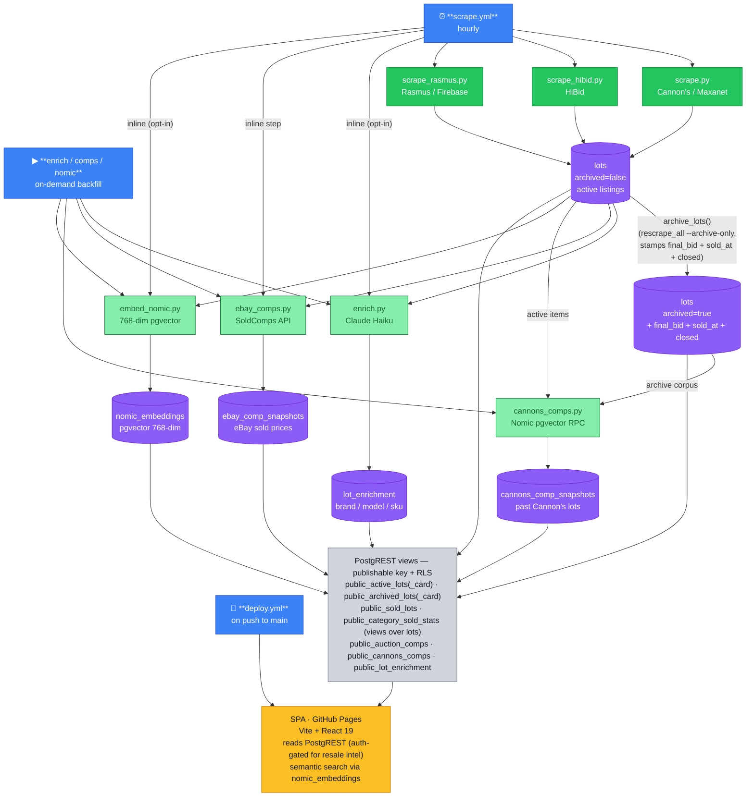

# Pipeline DAG

Data flow after the Supabase migration. NDJSON/Parquet files are written locally during a scrape run but **not committed to git** — Supabase is the sole durable destination.

> **Note (June 2026, migration 0030):** `sold_lots` is no longer a separate table — it is now a **view** over `lots WHERE archived AND final_bid > 0`, with the hammer price's close time (`sold_at`) promoted to a real column on `lots`. The old nightly `sold-history.yml` job (and `scraper/sold_history.py`) were removed; `archive_lots()` is the sole writer of archived/sold facts. The satellite tables (`lot_enrichment`, `nomic_embeddings`, `ebay_comp_snapshots`, `cannons_comp_snapshots`, `eval_embeddings`) now carry `ON DELETE CASCADE` foreign keys to `lots`, so pruning a lot cascades its derived rows.

## Key changes from the old architecture

| Before | After |
|--------|-------|
| `scrape.py` → NDJSON/Parquet in `public/data/` → committed to git hourly | `scrape.py` → Supabase `lots` directly (PostgREST upsert) |
| Browser `fetch()`s NDJSON files from GitHub Pages | Browser reads `public_active_lots` / `public_archived_lots` PostgREST views |
| A nightly `sold_history.py` job mirrored closed lots into a separate `sold_lots` table | `sold_lots` is a view over `lots` (archived + `final_bid` + `sold_at`); no separate job |
| `scrape.yml` commits `git add public/data/` every hour | `scrape.yml` has `contents: read` — no git writes |
| NDJSON/Parquet in git history (bloating the repo) | Only code + config in git; all data in Supabase |

## Secrets map

| Secret | Used by | Purpose |
|--------|---------|---------|
| `VITE_SUPABASE_URL` | scrape.yml, deploy.yml | PostgREST base URL |
| `SUPABASE_SECRET_KEY` | scrape.yml | Service-role key (bypasses RLS) for scraper writes |
| `VITE_SUPABASE_PUBLISHABLE_KEY` | deploy.yml | Browser-safe key baked into SPA bundle |
| `ANTHROPIC_API_KEY` | scrape.yml (opt-in) | LLM enrichment via enrich.py |
| `MOTHERDUCK_TOKEN` | scrape.yml (opt-in) | Optional MotherDuck snapshot mirror |
| `SOLDCOMPS_API_KEY` | scrape.yml | eBay sold-price lookups via SoldComps |
